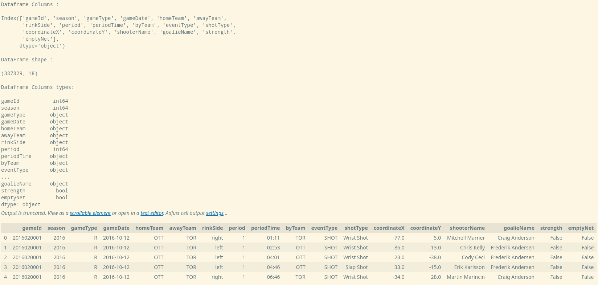

# Transformation de données brutes JSON en DataFrame

# Traitement de la valeur 'strength'

La valeur « strength » dans les données indique seulement si le jeu se déroule en situation d'égalité, en supériorité numérique ou en infériorité numérique. Cependant, cette indication n'est pas suffisante pour comprendre la dynamique exacte du jeu.

Pour ajouter une dimension quantitative à la force d'un play (au-delà de savoir si c'est en sur-nombre, sous-nombre ou égalité), nous pouvons explorer la liste des penaltyPlays, accessible via ['liveData']['plays']['penaltyPlays']. Un penaltyPlay nous fournit des informations clés : le temps de la pénalité, sa durée et le joueur pénalisé.

Chaque play est également horodaté. En exploitant ces informations temporelles, on peut déduire si un play donné s'est déroulé pendant une pénalité, et ainsi qualifier le contexte numérique précis (par exemple, 5 contre 4, 4 contre 3...). Une nouvelle colonne, appelée numerical_strength, pourrait ainsi être ajoutée, codifiant ces situations avec des notations comme '4vs1', '5vs4', etc.

# Ajout de caractéristiques supplémentaires

Lors de l'analyse de données de jeu, une étape cruciale consiste à enrichir notre compréhension en introduisant des caractéristiques supplémentaires basées sur les informations existantes. Avant de détailler ces caractéristiques, il est essentiel de noter que, pour chacune d'elles, l'utilisation de la fonction utils.py::unify_coordinates_referential est primordiale afin d'aligner les coordonnées selon une même orientation commune du terrain. Cette étape préliminaire garantit la cohérence et l'exactitude des mesures dérivées. Voici les caractéristiques proposées :

* **Angle du tir (shot_angle)** : 

   L'angle sous lequel un tir est effectué peut influencer sa chance de succès. En calculant cet angle en fonction des coordonnées du tir et de la position fixe du but, nous pouvons obtenir des perspectives sur les zones préférées des tireurs et les angles de tir les plus propices.

* **Distance par rapport au but (dist_from_goal)** : 

   Cette métrique mesure la distance entre le point d'où le tir est lancé et le but. En calculant cette distance à partir de la position fixe du but, soit le point [98,0], nous obtenons une indication sur la proximité et, potentiellement, sur la qualité du tir.

* **Contre-attaques (is_counter_attack)** : 

   Une contre-attaque se caractérise souvent par une récupération dans sa propre moitié de terrain, suivie d'une avancée rapide vers le but adverse. Pour identifier un tel scénario, nous examinerons le play précédant le tir : s'il est de type TAKEAWAY et s'est déroulé dans la moitié défensive de l'équipe qui effectue le play, alors nous avons une situation de contre-attaque.

* **Rebonds (is_shot_rebound)** : 

   Dans le hockey, un rebond correspond à un tir qui, après avoir été initialement arrêté ou dévié par le gardien, est rapidement suivi d'un autre tir. Pour cerner les rebonds, nous suggérons d'examiner le temps entre deux tirs consécutifs. Cette approche repose sur l'hypothèse qu'un rebond augmente la probabilité de marquer. En utilisant des visualisations et des tests statistiques, nous pourrions déterminer si une augmentation statistiquement significative des chances de marquer existe pour de courts intervalles de temps entre tirs. Si nous observons une telle tendance, tout tir ou but survenant dans un délai inférieur à un certain seuil pourrait être classé comme un "rebond", car il est suivi d'une seconde tentative avec une haute probabilité de marquer.

Grâce à l'introduction de ces nouvelles caractéristiques, notre analyse devient plus nuancée, nous permettant de mieux saisir les dynamiques et stratégies à l'œuvre lors des matchs.
